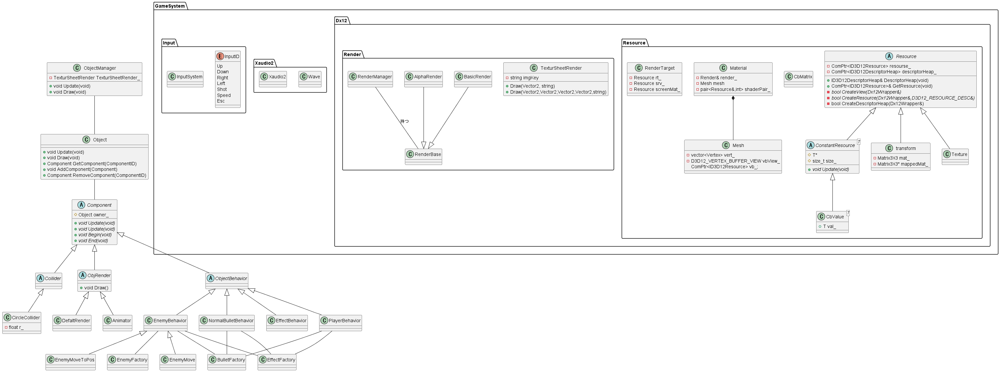

# 2DShootingGame

* 開発環境 C++ DirectX12 XAudio2 Xinput C#(ツール)
* 開発⼈数 ⼀⼈
* 制作期間 約4ヶ⽉

## ディレクトリ(フォルダ)説明

* 2DShootingDx12・・・ゲームのソースコードです。
* ConvertAnimationData・・・アニメーションデータ(xml形式)を変換するプログラムのソースコードです。
* TextureDataConvert・・・画像のデータ(xml形式)を変換するプログラムのソースコードです。
* 実行データ・・・ゲーム本体が入っています。

## 制作の目的

* DirectX12を使用してゲームを作ってみる

## 工夫した点

* ゲームオブジェクトとUI(スコア等)の描画をそれぞれ⼀つのメッシュで⾏っています。
* 各シーンで使うゲームオブジェクトの画像とUIの画像をそれぞれ1枚の画像にまとめています。
* アニメーションと画像についてのデータをxml形式のファイルからバイナリデータに変換するツールを作成して使⽤しています。

## 操作方法

* 矢印キーで移動
* zキーで射撃
* シフトキーで低速移動

## ゲーム画像

## クラス図

## 使用素材

* https://ansimuz.itch.io/spaceship-shooter-environment
* https://mattwalkden.itch.io/lunar-battle-pack

## 使用ライブラリ

* [DirectXTex](https://github.com/microsoft/DirectXTex)

    Copyright (c) 2011-2022 Microsoft Corp

    Permission is hereby granted, free of charge, to any person obtaining a copy of this
    software and associated documentation files (the "Software"), to deal in the Software
    without restriction, including without limitation the rights to use, copy, modify,
    merge, publish, distribute, sublicense, and/or sell copies of the Software, and to
    permit persons to whom the Software is furnished to do so, subject to the following
    conditions:

    The above copyright notice and this permission notice shall be included in all copies
    or substantial portions of the Software.

    THE SOFTWARE IS PROVIDED "AS IS", WITHOUT WARRANTY OF ANY KIND, EXPRESS OR IMPLIED,
    INCLUDING BUT NOT LIMITED TO THE WARRANTIES OF MERCHANTABILITY, FITNESS FOR A
    PARTICULAR PURPOSE AND NONINFRINGEMENT. IN NO EVENT SHALL THE AUTHORS OR COPYRIGHT
    HOLDERS BE LIABLE FOR ANY CLAIM, DAMAGES OR OTHER LIABILITY, WHETHER IN AN ACTION OF
    CONTRACT, TORT OR OTHERWISE, ARISING FROM, OUT OF OR IN CONNECTION WITH THE SOFTWARE
    OR THE USE OR OTHER DEALINGS IN THE SOFTWARE.
